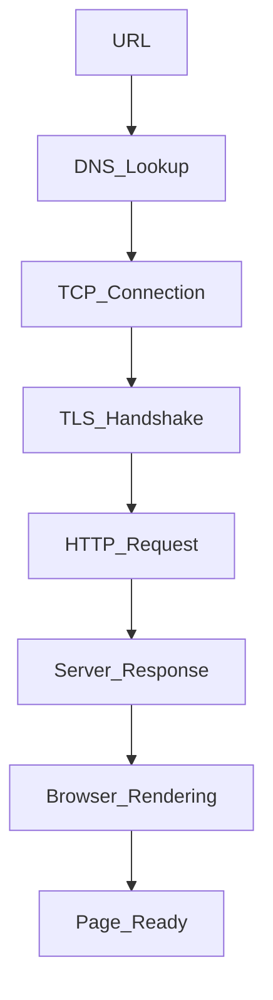

## 1. What is javascript, why use, pros and cons?

- final: `high-level` `dynamically typed` `single-threaded`

- JavaScript is a **high-level, interpreted programming language**.
- Runs mainly in the **browser**, but also on the **server (Node.js)**.
- Used to make web pages **interactive and dynamic**.
-
- just for info below
- JavaScript is a `single-threaded`, `dynamically typed`, `prototype-based`, `high-level interpreted programming language`, primarily used for creating interactive web applications.

---

### ❓ Why Do We Use JavaScript?

- To create **interactive web apps** (clicks, forms, animations, etc.)
- To handle **DOM manipulation**
- To make **API calls (fetch data without reload)**
- For **full-stack development** (Node.js + React)

---

### ✅ Pros of JavaScript

- 🌐 Runs in all browsers (no setup needed)
- ⚡ Fast execution (just-in-time compilation)
- 🧩 Works with HTML & CSS
- 💻 Supports both frontend & backend (with Node.js)
- 📦 Huge ecosystem (npm, libraries, frameworks)

---

### ❌ Cons of JavaScript

- 🐞 Loosely typed → more runtime bugs
- 🕵️‍♂️ Security issues (can be exploited if not handled properly)
- 🌍 Different browser behaviors (need polyfills sometimes)
- 🧠 Async can be tricky (callbacks, promises, etc.)

---

## 1.1 JavaScript Characteristics Explained

### 1️⃣ Dynamically Typed

- Variable types are **decided at runtime**, not during compilation.

```js
let x = 10; // number
x = "Hello"; // now it's a string — no error
```

### 2️⃣ Loosely Typed (Weakly Typed)

- Variables can hold any type, and JavaScript automatically converts types when needed (sometimes unexpectedly).
- Can lead to bugs if not careful with type coercion

```js
console.log(1 + "2"); // "12" → number + string = string
console.log("5" - 2); // 3 → string converted to number
```

### High-Level

- Abstracts away low-level things like memory management, pointers, etc.
  - 🧼 Easier to write, read, and understand compared to low-level languages like C

### Interpreted Language

- Code is executed line-by-line at runtime, not compiled ahead of time.
  - 💻 Browsers or Node.js interpret JS code on the fly (using V8 engine, for example)

### 3️⃣ Prototype-Based

- `first learn prototypes`
- JavaScript uses prototypes instead of classical classes for inheritance.
- Objects can inherit properties/methods from other objects.
- Inheritance is done via object prototypes, not classes (until ES6 introduced class as syntax sugar)

```js
const person = {
	greet() {
		console.log("Hi");
	},
};
const student = Object.create(person);
student.greet(); // Inherits from person
```

---

## 1.2 🧩 What is a Polyfill?

- A **polyfill** is a piece of fallback code (usually JavaScript) that **adds support for modern features** in **older browsers** that don’t support them natively.

> It's like a "patch" that lets your code work across all environments.

---

### 🛠 Example:

- A polyfill is fallback code that adds support for modern JavaScript features in older browsers. It lets me use the latest features without breaking compatibility.

Suppose you're using `Array.prototype.includes()` — supported in modern browsers, but not in Internet Explorer.

You can add a polyfill like this:

```js
if (!Array.prototype.includes) {
	Array.prototype.includes = function (value) {
		return this.indexOf(value) !== -1;
	};
}
```

Now older browsers will understand .includes()!

---

## 1.3 what do you mean by this : 🕵️‍♂️ Security issues (can be exploited if not handled properly)

---

## 1. Data Types in JavaScript

JavaScript has two main categories of data types:

---

### 🔹 1. **Primitive Data Types**

> Stored by value (not by reference)

- `String` → `"Hello"`
- `Symbol` → unique & immutable value (used as object keys)
- `Number` → `42`, `3.14`
- `Null` → intentional absence of value
- `Boolean` → `true`, `false`
- `BigInt` → large integers (e.g. `12345678901234567890n`)
- `Undefined` → declared but not assigned

---

### 🔸 2. **Non-Primitive (Reference) Data Types**

> Stored by reference (points to memory location)

- `Object` → `{ name: "John" }`
- `Array` → `[1, 2, 3]` (technically an object)
- `Function` → `function() {}` (also a type of object)

## 1. 📦 Reference vs Value | Shallow vs Deep Copy in JavaScript

### 🔹 Primitive Types → Stored by **Value**

> Copying creates a new value. Changes don’t affect the original.

```js
const a = "Hello";
const b = a;

b = "World";
console.log(a); // "Hello"
```

### 🔸 Non-Primitives (Objects, Arrays) → Stored by Reference

> Copying just points to the same memory. Changes affect both.

```js
const obj1 = { name: "Alice" };
const obj2 = obj1;

obj2.name = "Bob";
console.log(obj1.name); // "Bob"
```

### 🔁 Shallow Copy

> Only top-level properties are copied. Nested objects are still shared.

```js
const obj1 = { name: "Alice", address: { city: "NY" } };
const obj2 = { ...obj1 }; // Shallow copy
const obj2 = Object.assign({}, obj1); // Shallow copy

obj2.name = "Bob"; // ✅ ok
obj2.address.city = "LA"; // ❌ affects obj1

console.log(obj1.address.name); // "Alice"
console.log(obj1.address.city); // "LA"
```

### 🧬 Deep Copy

> Fully independent copy (including nested objects)

```js
// ✅ Method 1: JSON trick (simple objects only)
const obj2 = JSON.parse(JSON.stringify(obj1));

// ✅ Method 2: structuredClone (modern, safe)
const obj2 = structuredClone(obj1);
```

---

## 1. ⚖️ null vs undefined in JavaScript

| Feature | `null`                           | `undefined`                        |
| ------- | -------------------------------- | ---------------------------------- |
| Meaning | Intentional absence of value     | Variable declared but not assigned |
| Type    | `object` (weird JS quirk)        | `undefined`                        |
| Set By  | Developer (manually)             | JavaScript (by default)            |
| Usage   | When you want to "empty" a value | When a value hasn't been set yet   |

---

### ✅ Examples:

```js
let a;
console.log(a); // undefined

let b = null;
console.log(b); // null
```

---

## 1. Scope

- Scope determines where variables can be accessed in your code.
- Global
- Functional (){}
- Block(let and const)

---

## 2. Hoisting

- Hoisting means JavaScript moves **`declarations`** (not initializations) to the top of their scope before running the code.
- variables (var) and functions can be used before they are declared.
- Only var and function declarations are hoisted, let and const are also hoisted but in different way. let and const are in a "temporal dead zone" before declaration.

---

## 3. Temporal dead zone

- TDZ is the time **between** a variable being **declared** and **initialized** where it **cannot be accessed**.
- It happens with **`let` and `const`**, not with `var`.

---

### 🔥 Example:

```js
console.log(x); // ❌ ReferenceError
let x = 10;
```

### 🧠 Why It Happens:

- let and const are hoisted, but not initialized.
- JavaScript knows the variable exists in memory, but it won’t allow access until the actual line of initialization.

---

## 4. Closures

- A closure is a function that remembers variables from the outer scope or parent function even after the outer function has finished executing.

---

## 5. Execution context

- An Execution Context is the `environment` in which JavaScript code is evaluated and executed.
- Every time a function runs, a new execution context is created.

---

## 6. Difference between var, let and const

| Feature                       | `var`                | `let`      | `const`        |
| ----------------------------- | -------------------- | ---------- | -------------- |
| Scope                         | Function             | Block      | Block          |
| Hoisted                       | Yes (as `undefined`) | Yes (TDZ)  | Yes (TDZ)      |
| Re-declaration                | ✅ Allowed           | ❌ Error   | ❌ Error       |
| Re-assignment                 | ✅ Allowed           | ✅ Allowed | ❌ Not allowed |
| Attached to `window` (global) | ✅ Yes               | ❌ No      | ❌ No          |

---

## 7. ## ⚡ Arrow Functions vs Normal Functions

**Arrow functions** are a shorter syntax for functions in JavaScript (ES6), mainly differing in **`this` binding**, `arguments`, and constructor behavior.

---

### 📌 Key Differences

| Feature            | Arrow Function                       | Normal Function                          |
| ------------------ | ------------------------------------ | ---------------------------------------- |
| `this` binding     | Lexical (inherits from parent scope) | Dynamic (based on how called)            |
| `arguments` object | Not available                        | Available                                |
| Constructor usage  | ❌ Not allowed                       | ✅ Can use `new`                         |
| Hoisting           | ❌ No                                | ✅ Yes                                   |
| Syntax             | Short & concise                      | Verbose                                  |
| Use case           | Small callbacks, utilities           | General functions, methods, constructors |

---

### 🔤 Examples

```js
// Arrow Function
const add = (a, b) => a + b;

// Normal Function
function add(a, b) {
	return a + b;
}
```

### ✅ Key Points

- Use **arrow functions** for short tasks, callbacks, or functional programming (`map`, `filter`, etc.)
- Use **normal functions** when you need:
  - Your own `this`
  - `arguments` object
  - Hoisting
  - Constructor behavior (`new`)

---

## 8. this keyword in javascript

- `this` refers to the **context** from where a function is called.
- Its value depends on **how** the function is invoked.
- In regular functions, it depends on the caller;
- In arrow functions, it’s lexically inherited from the parent scope.

---

### 📌 `this` in different contexts:

| Context               | `this` refers to               |
| --------------------- | ------------------------------ |
| Global scope          | `window` (in browser)          |
| Function (non-strict) | `window`                       |
| Function (strict)     | `undefined`                    |
| Object method         | That object                    |
| Class constructor     | The instance being created     |
| Arrow function        | Lexical (inherits from parent) |

---

### 🧠 Arrow Function Example:

```js
const obj = {
	name: "JS",
	arrowFn: () => {
		console.log(this); // ❌ Not obj, it's window (or undefined in strict mode)
	},
};
```

```js
const obj = {
	name: "JS",
	normalFn: function () {
		console.log(this); // ✅ Refers to obj
	},
};
```

---

## 9. bind/call/apply

- js qna : 9
- **`call`**: Invokes function with a specified `this` and **arguments listed individually**

  ```js
  funcName.call(object, arg1, arg2, ...)
  ```

- **`apply`**: Invokes function with a specified `this` and **arguments passed as an array**

  ```js
  funcName.apply(object, [arg1, arg2, ...])
  ```

- **`bind`**: Returns a **new function** with `this` bound and optionally preset arguments
  ```js
  const newFn = funcName.bind(object, arg1, arg2, ...)
  ```

### 🧠 Example:

```js
function greet(greeting, punctuation) {
	console.log(greeting + ", " + this.name + punctuation);
}

const person = { name: "Alice" };

greet.call(person, "Hello", "!"); // Hello, Alice!
greet.apply(person, ["Hi", "!!!"]); // Hi, Alice!!!
const boundGreet = greet.bind(person, "Hey", "?");
boundGreet(); // Hey, Alice?
```

```js
function greet(msg, punc) {
	console.log(msg + ", " + this.name + punc);
}
const user = { name: "Alice" };

greet.call(user, "Hello", "!"); // Hello, Alice!
greet.apply(user, ["Hi", "!!"]); // Hi, Alice!!
const fn = greet.bind(user, "Hey", "?");
fn(); // Hey, Alice?
```

---

## 10. Promises

- A Promise is a JavaScript object that represents the eventual result (or failure) of an asynchronous operation.
- state: pending(initial), fulfilled and rejected
- Promises make async code cleaner and chainable
- new Promise((resolve,reject) => {})

---

## 11. async / await

- async makes a function return a Promise.
- await waits for the Promise to resolve/reject before continuing.
- for error handling you have to use try catch

---

## 12. fetch api

- The Fetch API is used to make HTTP requests (like GET, POST) from the browser.
  It returns a Promise that resolves to the response.

---

## 13. Event loop, Microtask and macrotask

- The Event Loop is the mechanism that allows JavaScript to perform non-blocking, asynchronous operations — even though JavaScript is single-threaded.
- It manages what code runs now and what runs later.
- JavaScript executes:
  1. Synchronous code (line by line)
  2. Then all Microtasks
  3. Then one Macrotask, and repeats the cycle.
- Execution Order: Call Stack ➝ Microtask Queue ➝ Macrotask Queue
- Microtasks: .then(), catch(), async/await, fetch api
- Macrotasks: setTimeout, setInterval

---

## 14. Microtasks vs Macrotasks

---

## 15. map, filter, reduce, find, some, every

- map: Creates a new array.
- filter: Creates a new array with element that pass a condition.
- reduce: Reduces the array to a single value.
- find: Returns the first element that matches a condition.
- some(or): Returns true if at least one element matches the condition.
- every(and): Returns true if all elements match the condition.

---

## 17. Explain the difference between spread and rest operators.

Both use the `...` syntax but serve **opposite purposes** based on context.

---

### 🔹 Spread Operator (`...`)

- **Expands** elements of an iterable (like arrays or objects).
- Used in array/object literals or function calls to **unpack values**.

```js
const arr1 = [1, 2];
const arr2 = [...arr1, 3]; // [1, 2, 3]

const obj1 = { a: 1 };
const obj2 = { ...obj1, b: 2 }; // { a: 1, b: 2 }
```

### 🔸 Rest Operator (...)

- Collects multiple elements into a single array.
- Used in function parameters or destructuring to pack values.

```js
function sum(...numbers) {
	return numbers.reduce((a, b) => a + b, 0);
}

const [first, ...rest] = [10, 20, 30];
// first = 10, rest = [20, 30]
```

---

## 18. Optional chaining ?., nullish coalescing ??

- Use ?. to avoid crashes on missing properties. Right before the property where parent obj might not exist.

---

## 19. && vs ?? vs ||

- && — AND: If the first thing is true, return the second.
- || — OR: If the first thing is false, use the second.
- ?? — Nullish Coalescing: If the first thing is null or undefined, use the second.

---

## 20. Module system: import/export, CommonJS vs ESM

- CommonJS:
  - require() / module.exports
  - .js
  - Synchronous
- ESM:
  - import/export
  - .mjs (or set "type": "module" in package)
  - Asynchronous

---

## 20. IIFE

---

## 22. Higher Order Function

A function that **takes another function as an argument** or **returns a function**.

## 22. Pure Function

A function that:

- Always gives the **same output** for the **same input**
- Has **no side effects** (doesn’t modify external state or data)

## 22. First class Function

In JavaScript, functions are **first-class citizens**, meaning:

- You can **store them in variables**
- **Pass them as arguments**
- **Return them** from other functions

---

## 23. Prototype & Prototypal Inheritance

- Every JavaScript object has a hidden internal property: `[[Prototype]]`
- It points to another object — called the **prototype**.
- Used for **inheritance** — if a property/method isn’t found on the object, JS looks up the prototype chain.

---

### 📌 Example:

```js
const obj = {
	greet() {
		console.log("Hello");
	},
};

const newObj = Object.create(obj);
newObj.greet(); // Hello (inherited from obj)
```

---

### 🔍 Function Prototype:

- Every function in JS has a `.prototype` property.
- Used when creating objects via constructor functions.

```js
function Person(name) {
	this.name = name;
}
Person.prototype.sayHi = function () {
	console.log("Hi, " + this.name);
};

const p = new Person("Alice");
p.sayHi(); // Hi, Alice
```

---

## 24. Pure & Impure functions

---

## 25. Lamba Function

---

## 26. Curring

- Currying is the process of `breaking a function` with `multiple arguments`
- into a series of functions that each take a single argument.

```js
function add(a) {
	return function (b) {
		return a + b;
	};
}

const addFive = add(5);
console.log(addFive(3)); // 8
console.log(addFive(10)); // 15
```

---

## 28. New keyword

---

## 29. Object in Js

---

## 30. Accessing Object Properties 2 Ways

---

## 31. Strict mode

---

## 32. Local Storage vs Session Storage vs IndexedDB vs Cookies

These are browser-based storage mechanisms used to store client-side data, each with different limits, lifetimes, and use cases.

## 1️⃣ Local Storage

📌 **Stores key–value data with no expiration.**

- **Persistence:** Data persists **even after the browser is closed**.
- **Scope:** Shared across all tabs/windows of the **same origin**.
- Synchronous API
- **Storage Limit:** ~5-10 MB (varies by browser).
- Stores **strings only**

> **Best for:** Preferences, themes, settings, small persistent data

---

## 2️⃣ Session Storage

📌 **Stores data for a single page session (per tab).**

- Persistence: Data lasts only for the current tab session.
- Scope: Unique to each tab/window; not shared between tabs.
- Storage Limit: Similar to LocalStorage (~5 MB).
- Stores **strings only**

> **Best for:** Temporary data, form steps, session-specific state

---

## 3️⃣ IndexedDB

📌 **A client-side NoSQL database for structured and large data.**

- Asynchronous
- Stores objects, arrays, files, and blobs
- Very large storage capacity (hundreds of MBs)
- Supports advanced queries and indexing

> **Best for:** Offline apps, large datasets, caching API responses

---

## 4️⃣ Cookies

📌 **Small pieces of data automatically sent with every HTTP request.**

- Max size ~4KB
- Can have expiration times
- Accessible by both client and server
- Commonly used for authentication and session tracking

> **Best for:** Authentication, sessions, server communication

---

## ⚡ Interview Tip

- **Cookies** → Server communication + authentication
- **LocalStorage / SessionStorage** → Simple client-side key–value data
- **IndexedDB** → Large, complex, or offline-first storage

---

## 34. Lexical Environment

### 📌 Lexical Scope

- The scope of a variable is determined by **where it is declared in the code**, not where it is called.
- In JavaScript, **child functions can access variables defined in their parent functions** due to lexical scope.
- Think of it as: a function “sees” variables in the scope where it was **defined**, not where it is executed.

> Lexical scope = variable accessibility is decided at **definition time**, not at call time.

---

### 📌 Lexical Environment

- A **memory structure used by the JavaScript engine** to keep track of variables and their values.
- Each execution context (global, function, block) has its own **lexical environment**.
- Contains:
  - **Environment record**: stores actual variable and function bindings
  - **Reference to outer environment**: enables scope chain lookup

> In short, the lexical environment is **how JavaScript implements lexical scope internally**.

---

## 35. Array and string includes

---

## 36. Debounce

- **Debounce** ensures that a function is **called only after a certain amount of time has passed since the last call**.
- Useful to **limit the rate of execution** for events that fire frequently, like `resize`, `scroll`, or `input`.

```js
function debounce(func, delay) {
	let timeout;

	return function (...args) {
		clearTimeout(timeout);
		timeout = setTimeout(() => func.apply(this, args), delay);
	};
}

function handleInput(event) {
	console.log("Searching for:", event.target.value);
}

const debouncedInput = debounce(handleInput, 300);

document.getElementById("searchBox").addEventListener("input", debouncedInput);
```

---

## 37. Throttle

- Throttle ensures that a function is called at most once in a specified time interval, no matter how many times the event is triggered.
- Useful to limit the frequency of function execution.

Use Cases:

- Scroll events
- Button click rate limiting
- Mouse movement tracking

---

## 38. Deep copy

---

## 39. Flatten array

---

## 40. Unique values

---

## 41. module scope and type of scopes

---

## 42. memoize function

---

## 43. es6 vs before

---

## 44. event delegation

---

## 45. 5 ways to create object

## 46. What is shadowing

## 47. What are the key differences between React and vanilla JavaScript?

- Vanilla JavaScript manipulates the `DOM` manually, which gets `messy` as the app grows.
-
- React makes **UI building** easier with **components, virtual DOM, and state management**.
- It helps write **clean, reusable, and scalable** code — especially for dynamic UIs.
-
- React is built on top of JavaScript, but offers a smarter structure for building apps.

---

## 48. Why should we use React over plain JavaScript or HTML?

- React makes `UI building` faster and cleaner with components and reusable code.
- It handles DOM updates automatically with the virtual DOM, so no manual DOM code.
- Managing `state` and dynamic data is much easier in React.
- Great for scalable projects — plain JS/HTML gets `messy` as app size grows.

---

### 49. What is the Real DOM?

- The **Real DOM** is the **actual structure of the webpage** that the browser builds from HTML.
- It’s like a **tree of elements** — every tag (`<div>`, `<p>`, `<button>`) is a node in this tree.
- When we change something (like text, style, etc.), the **Real DOM updates the page**.
- But updating it directly is **slow**, especially if there are many changes.

### 50. What is ecmascript

- ECMAScript ek standard hai jo batata hai JavaScript kaise kaam kare — jaise ek guideline ya rulebook.
- ECMAScript is the **rulebook** for JavaScript.
- iska kaam hai rules define karna — jaise `syntax`, `features`, aur `behavior`.
- Bas, jitne naye versions aate hain (jaise ES6(2015), ES2020), naye features add hote hain.

### 51. synchronous vs asynchronous

### ⏱️ Synchronous

- Code is executed **line-by-line**, one after another.
- Each line **waits for the previous one** to finish.
- Can block the main thread (slow UI / performance issues).

### ⚡ Asynchronous

- Code runs non-blocking, allowing other tasks to continue.
- Useful for operations that take time — like API calls, timers, file read, etc.
- Uses: Callbacks, Promises, async/await

## 52. ⚡ What Are Events in JavaScript?

- Events are **actions or occurrences** that happen in the browser.
- The browser can respond to these events using **event listeners**.
- Common in interactive web apps.

---

### 🎯 Examples of Events:

- `click` – User clicks a button
- `keydown` – User presses a key
- `submit` – Form is submitted
- `load` – Page finishes loading
- `mouseover` – Mouse hovers over an element

## 53. 🎧 What is an Event Listener in JavaScript?

- An **Event Listener** is a function that **waits for a specific event to happen**, then runs code in response.

> It’s how we tell the browser: “When this happens, do that.”

## 54. 🔍 What is Scope in JavaScript?

- **Scope** defines **where a variable is accessible** in your code.
- JavaScript has global, function, and block scopes depending on where and how variables are declared.

### Global Scope

- Variables declared **outside** any function or block.
- Accessible **anywhere** in the code.

### Function Scope

- Variables declared with var inside a function.
- Accessible only inside that function.

### Block Scope

- Variables declared with let or const inside {} (if, for, etc.)
- Accessible only within that block

> It answers: "Can I access this variable here?"

## 55. Can We Create Scope Without Curly Braces?

- So, you can’t create block scope without {}, but function scope exists with or without {} in concise arrow functions.
- Scope creation depends on the type:
  - Block scope (for let/const) requires curly braces {}.
  - Function scope is created by functions themselves, which need {} for their body—except arrow functions with a single expression don’t use {} but still create function scope.

## 56. what is closures, where/why should we use it

- A **closure** is when a function **remembers** variables from its outer scope, even after the outer function has finished executing.
- It gives you access to variables from an outer function **inside** an inner function, **even after** the outer function has returned.

```js
function outer() {
	let count = 0;
	return function inner() {
		count++;
		console.log(count);
	};
}

const counter = outer();
counter(); // 1
counter(); // 2
```

### 🔹 Where?

- **Data privacy:** To create private variables not accessible from outside.
- **Maintain state:** In functions like counters, timers, or caches.
- **Callbacks & event handlers:** To remember variables in asynchronous code.
- **Functional programming:** For partial application, currying, and memoization.

---

### 🔹 Why?

- To **encapsulate data** and avoid polluting global scope.
- To **keep state** without using global variables or classes.
- To write **cleaner, modular code** with better control over variables.

## 57. multi threading vs single threading

- Single Threading: A single thread can do only one task at a time in a specific order (synchronously).

  - Executes code line by line.
  - If one task takes time (e.g., file read), it blocks the others.
  - Example: JavaScript is single-threaded (main thread).

- Multi-threading allows a program to run multiple tasks at the same time (in parallel or concurrently).
  - Uses multiple threads.
  - Can handle multiple operations without waiting for one to finish.
  - Example: Java, C++, Python (with threading), and Node.js worker threads.

## 58. why javascript is so popular

- JavaScript is the only language natively supported by all web browsers.
- With Node.js, you can use JavaScript on the server-side too.
- allowing developers to use it on both the front-end and back-end. and it has low learning curve.

## 59. can we use mongodb without javascript

- MongoDB can be used with many programming languages.
- Although MongoDB uses a JavaScript-like syntax in its shell (like db.collection.find()), you don't need to use JavaScript to interact with it in real projects.
- MongoDB uses BSON (Binary JSON) internally, which is language-neutral.
- This is why it's easy to integrate with multiple languages, not just JavaScript

## 60. what is callback in javascript

- A callback is a function passed as an argument to another function.
- It gets executed after the main function is done.
- Commonly used in asynchronous operations like API calls, timers, or file handling.
- Helps in handling tasks that take time without blocking the rest of the code.
- Can be synchronous or asynchronous, depending on how it’s used.

---

## 61. what is promises

- A Promise is a built-in JavaScript object used to handle asynchronous operations.
- It represents a value that may be available now, later, or never.
- Helps avoid callback hell and makes async code more readable.
- states: Pending, Fulfilled, Rejected

---

## 62. why we should use promise i we already have callback

- Callbacks definitely work—but they can quickly become `messy and difficult to manage` when dealing with multiple asynchronous tasks.
- This mess is often called **callback hell** deeply nested functions that are hard to `read, maintain, and debug`.
- Promises help solve this problem by allowing us to chain asynchronous operations using .then() and handle errors centrally with .catch(), leading to cleaner, more readable code.

---

## 63. what is call back hell

- **Callback Hell** refers to a situation in JavaScript where you have multiple nested callbacks, making the code hard to `read`, `maintain`, and `debug`.
- This usually happens when you perform many asynchronous operations that depend on each other, and you use callbacks to handle each step.

## 64. What is Recursion?

- **Recursion** is a programming technique where a function **calls itself** to solve smaller instances of a problem.
- It breaks a complex problem into **simpler, smaller sub-problems**.
- Each recursive call works on a smaller piece until it reaches a **base case**, which stops the recursion.

## 65. what is Promise.all and Promise.race

### ✅ Promise.all

- Takes **an array of promises** and returns a **single promise**.
- Resolves **when all promises resolve**.
- Rejects **if any promise rejects**.
- Useful when you want **all async tasks done** before proceeding.

```js
Promise.all([promise1, promise2, promise3])
	.then((results) => {
		// results is an array of all resolved values
	})
	.catch((error) => {
		// error from any rejected promise
	});
```

### ⚡ Promise.race

- Takes an array of promises and returns a single promise.
- Resolves or rejects as soon as the first promise settles (either resolve or reject).
- Useful when you want the fastest response among multiple promises.

```js
Promise.race([promise1, promise2, promise3])
	.then((result) => {
		// result of the first settled promise
	})
	.catch((error) => {
		// error of the first rejected promise
	});
```

## 66. setTimeout vs setInterval

| Feature        | `setTimeout`              | `setInterval`                   |
| -------------- | ------------------------- | ------------------------------- |
| Purpose        | Runs **once** after delay | Runs **repeatedly** at interval |
| Executes after | Delay (in ms)             | Every interval (in ms)          |
| Returns        | Timeout ID                | Interval ID                     |

## 67. how to stop setinterval

- Use clearTimeout() and clearInterval() with the returned ID

```js
const timeoutId = setTimeout(() => {
	console.log("This won't run");
}, 2000);
clearTimeout(timeoutId);

clearInterval(intervalId);
```

## 68. typeof

- `typeof` is an **operator** used to **check the data type** of a value.
- It returns a **string** describing the type.

### typeof Array , why

```js
typeof [1, 2, 3]; // "object"
```

### Why is typeof array "object"?

- In JavaScript, arrays are a type of object.
- typeof can’t distinguish between arrays and general objects.
- to properly check: Array.isArray([1, 2, 3]); // true

### 💡 1. Arrays are Objects in JavaScript

- In JavaScript, almost everything except `primitives data` types is an **object**.
- An **array is a special kind of object** — optimized for storing ordered data.

### ⚙️ 2. Internally, Arrays Are Objects with Extra Features

- Arrays are constructed using Array constructor, which is a function object.
- Under the hood, an array is just an object with:
  - Indexed keys (0, 1, 2...)
  - A special property called .length
  - Array-specific methods like .push(), .map(), .filter()

```js
const arr = [10, 20];
console.log(arr); // {0: 10, 1: 20, length: 2}
```

### 🧠 3. typeof is Not Precise

- The typeof operator is not meant to tell you the specific type of objects (like arrays, dates, etc.)
- It can only distinguish between primitive types and "object".

```js
// So even though you're writing:
const arr = [1, 2, 3];

// It's still:
const arr = new Array(1, 2, 3); // behind the scenes
```

> And this is an object, just with special behavior.

---

## 69. typeof string, any why ?

- `typeof` shows **primitive type** unless it's a **non-primitive object**.
- **Strings** like `"hello"` are **primitive**, so:

```js
typeof "hello"; // "string"
```

---

## 70. why type of array is object and string is string

- above

---

## 71. What happens when you type a URL and hit Enter?

- When I hit enter after typing a URL, the browser does a DNS lookup to find the IP, establishes a TCP connection, does a TLS handshake if it's HTTPS, sends an HTTP request, and then starts rendering the response — parsing HTML, applying CSS, running JS — until the full page loads.

### 🧭 Step-by-step Breakdown:

1. **DNS Lookup**

   - URL → IP address using DNS.

2. **TCP Connection**

   - `Browser` establishes a **TCP handshake** (via port 80/443).

<!-- 3. **HTTPS (TLS Handshake)**

   - If HTTPS, browser and server exchange certificates and keys. -->

4. **HTTP Request Sent**

   - `Browser` sends a **GET** request for the web page.

5. **Server Response**

   - Server sends back HTML, CSS, JS, images, etc.

6. **Browser Rendering**

   - HTML parsed → DOM created
   - CSS applied → Render Tree
   - JS executed → Dynamic content loaded

7. **Page Loaded & Displayed**



## 72. output of 2 loop with setTimeout, one with var and other with let, reason

- 🔹 var

  - var is function-scoped, not block-scoped.
  - All iterations share the same i, which ends up being 3 after the loop.
  - By the time setTimeout runs, i is already 3.

- 🔹 let
  - let is block-scoped.
  - JavaScript creates a new copy of i for every loop cycle.
  - For each loop iteration, JavaScript creates a new block scope.
  - The setTimeout function is created inside that scope, and it remembers ( the value of i from that iteration. because of closures.
  ```js
  {
  	let i = 2;
  	setTimeout(() => console.log(i), 1000);
  }
  ```

## 73. JSON vs Object – What are the differences?

### 🔶 1. Definition

- **JSON (JavaScript Object Notation)**: A **string-based** data format used for `data exchange`. It is language-independent but based on JavaScript syntax.
- **Object**: A data structure in JavaScript used to store key-value pairs.

### 🔶 2. Syntax Differences

- JSON keys and string values **must be in double quotes**.
- JS Objects can have keys without quotes and support functions and other complex types.

```js
// JSON (valid only as a string)
'{ "name": "Alice", "age": 25 }'

// JavaScript Object
{ name: "Alice", age: 25 }
```

## 74. How does reference vs value work in JavaScript?

- **Primitive types** (`string`, `number`, `boolean`, etc.) are **passed by value** — a copy is created; changes don’t affect original.
- **Objects, Arrays, Functions** are **passed by reference** — variables point to the same memory; changes affect all references.
- Assigning primitives copies the value, assigning objects copies the reference.
- To avoid mutation bugs, use shallow/deep copies (`spread`, `Object.assign`, `structuredClone`).

---

### Examples:

```js
// Passed by value
let a = 5;
let b = a;
b = 10;
console.log(a); // 5

// Passed by reference
let obj1 = { name: "Alice" };
let obj2 = obj1;
obj2.name = "Bob";
console.log(obj1.name); // 'Bob'
```

## 75. What are JavaScript Objects and their methods?

A **JavaScript object** is a collection of key-value pairs used to store and organize data. Keys are strings (or Symbols), and values can be any type.

- 📦 Defined using `{ key: value }` syntax
- 🧩 Can hold functions (called methods) as values
- 🔁 Commonly used to model real-world entities

```js
const user = {
	name: "Alice",
	age: 25,
	greet() {
		console.log(`Hello, I'm ${this.name}`);
	},
};

user.greet(); // Hello, I'm Alice
```

### ✅ Common Object Methods

- `Object.keys(obj)` → 🔑 array of keys
- `Object.values(obj)` → 📦 array of values
- `Object.entries(obj)` → 🧾 array of `[key, value]` pairs
- `Object.assign(target, source)` → 🛠️ copy properties
- `Object.hasOwnProperty(key)` → ✅ check if key exists
- `Object.freeze(obj)` → ❄️ make object immutable
- `Object.seal(obj)` → 🔒 prevent adding/removing properties

```js
const obj = { a: 1, b: 2 };
Object.keys(obj); // ['a', 'b']
Object.values(obj); // [1, 2]
Object.entries(obj); // [['a', 1], ['b', 2]]
```

## 76. forEach vs map, what both return?

- `forEach` executes a function on each element and returns **`undefined`**
- `map` transforms each element and returns a **new array** of results
- Use `forEach` for side effects (e.g., logging), `map` to create new arrays
- Neither modifies the original array directly (unless you mutate inside `forEach`)

```js
const nums = [1, 2, 3];
nums.forEach((n) => console.log(n)); // returns undefined
const doubled = nums.map((n) => n * 2); // returns [2, 4, 6]
```

## 77. Difference Between Axios and Fetch

**Axios** and **Fetch** are both used to make HTTP requests in JavaScript but have key differences.

---

### 📌 Key Differences

| Feature                  | Axios ✅                                | Fetch API 🌀                    |
| ------------------------ | --------------------------------------- | ------------------------------- |
| Browser Support          | Supports older browsers with polyfills  | Native in modern browsers only  |
| Syntax                   | Simple and concise                      | Requires more manual setup      |
| Response Handling        | Automatically parses JSON               | Needs `.json()` to parse JSON   |
| Request Cancellation     | Supports cancellation (via CancelToken) | No built-in cancellation        |
| Interceptors             | Supports request/response interceptors  | No built-in interceptors        |
| Error Handling           | Throws error for HTTP errors            | Only rejects on network failure |
| Default Timeout          | Supports timeout configuration          | No built-in timeout             |
| Upload/Download Progress | Supports progress events                | Limited support                 |

---

### ✅ Key Takeaways

- Use **Axios** for more features, ease of use, and better error handling
- Use **Fetch** for native, lightweight requests in modern environments
- Axios simplifies many HTTP tasks with built-in utilities

## 78. f

## 79. asd

## 80. fasdf

## 81. asd

## 82. f

## 83. sd

## 84.
