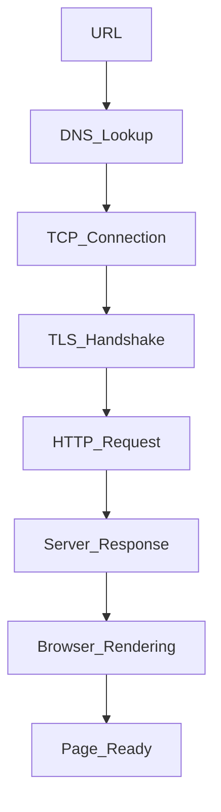

## 1. Tell me about your current and previous projects

---

## 2. What is your role in the current project

---

## 3. dsa question : give longest substring without repeating

---

## 4. What is javascript

-- js qna 1

---

## 5. What is ecmascript

- ECMAScript ek standard hai jo batata hai JavaScript kaise kaam kare — jaise ek guideline ya rulebook.
- ECMAScript is the **rulebook** for JavaScript.
- iska kaam hai rules define karna — jaise syntax, features, aur behavior.
- Bas, jitne naye versions aate hain (jaise ES6(2015), ES2020), naye features add hote hain.

---

## 6. synchronous vs asynchronous

### ⏱️ Synchronous

- Code is executed **line-by-line**, one after another.
- Each line **waits for the previous one** to finish.
- Can block the main thread (slow UI / performance issues).

### ⚡ Asynchronous

- Code runs non-blocking, allowing other tasks to continue.
- Useful for operations that take time — like API calls, timers, file read, etc.
- Uses: Callbacks, Promises, async/await

---

## 7. If there is a function that's asynchronous and it's 100 lines long — do all those 100 lines run in parallel or at the same time?

- JavaScript is single-threaded, so even in an async function, the lines of code run sequentially until the first await.
- Only the asynchronous parts (after await) are paused and resumed later — they don’t run in parallel.
- So, the 100 lines don’t run simultaneously; they run in order, unless some lines use await, callbacks, or Promises.

---

## 8. ⚡ What Are Events in JavaScript?

- Events are **actions or occurrences** that happen in the browser.
- The browser can respond to these events using **event listeners**.
- Common in interactive web apps.

---

### 🎯 Examples of Events:

- `click` – User clicks a button
- `keydown` – User presses a key
- `submit` – Form is submitted
- `load` – Page finishes loading
- `mouseover` – Mouse hovers over an element

---

## 9. 🎧 What is an Event Listener in JavaScript?

- An **Event Listener** is a function that **waits for a specific event to happen**, then runs code in response.

> It’s how we tell the browser: “When this happens, do that.”

---

## 10. 📦 Data Types in JavaScript

JavaScript has two main categories of data types:

---

### 🔹 1. **Primitive Data Types**

> Stored by value (not by reference)

- `String` → `"Hello"`
- `Symbol` → unique & immutable value (used as object keys)
- `Number` → `42`, `3.14`
- `Null` → intentional absence of value
- `Boolean` → `true`, `false`
- `BigInt` → large integers (e.g. `12345678901234567890n`)
- `Undefined` → declared but not assigned

---

### 🔸 2. **Non-Primitive (Reference) Data Types**

> Stored by reference (points to memory location)

- `Object` → `{ name: "John" }`
- `Array` → `[1, 2, 3]` (technically an object)
- `Function` → `function() {}` (also a type of object)

---

### 🧪 typeof Examples:

```js
typeof null; // "object" ❗ (JavaScript quirk)
typeof undefined; // "undefined"
typeof "hello"; // "string"
typeof 42; // "number"
typeof [1, 2, 3]; // "object"
typeof function () {}; // "function"
```

---

## 10.1 📦 Reference vs Value | Shallow vs Deep Copy in JavaScript

### 🔹 Primitive Types → Stored by **Value**

> Copying creates a new value. Changes don’t affect the original.

```js
const a = "Hello";
const b = a;

b = "World";
console.log(a); // "Hello"
```

### 🔸 Non-Primitives (Objects, Arrays) → Stored by Reference

> Copying just points to the same memory. Changes affect both.

```js
const obj1 = { name: "Alice" };
const obj2 = obj1;

obj2.name = "Bob";
console.log(obj1.name); // "Bob"
```

### 🔁 Shallow Copy

> Only top-level properties are copied. Nested objects are still shared.

```js
const obj1 = { name: "Alice", address: { city: "NY" } };
const obj2 = { ...obj1 }; // Shallow copy

obj2.name = "Bob"; // ✅ ok
obj2.address.city = "LA"; // ❌ affects obj1

console.log(obj1.address.name); // "Alice"
console.log(obj1.address.city); // "LA"
```

### 🧬 Deep Copy

> Fully independent copy (including nested objects)

```js
// ✅ Method 1: JSON trick (simple objects only)
const obj2 = JSON.parse(JSON.stringify(obj1));

// ✅ Method 2: structuredClone (modern, safe)
const obj2 = structuredClone(obj1);
```

---

## 11. ⚖️ null vs undefined in JavaScript

| Feature | `null`                           | `undefined`                        |
| ------- | -------------------------------- | ---------------------------------- |
| Meaning | Intentional absence of value     | Variable declared but not assigned |
| Type    | `object` (weird JS quirk)        | `undefined`                        |
| Set By  | Developer (manually)             | JavaScript (by default)            |
| Usage   | When you want to "empty" a value | When a value hasn't been set yet   |

---

### ✅ Examples:

```js
let a;
console.log(a); // undefined

let b = null;
console.log(b); // null
```

---

## 12. 🔍 What is Scope in JavaScript?

- **Scope** defines **where a variable is accessible** in your code.
- JavaScript has global, function, and block scopes depending on where and how variables are declared.

> It answers: "Can I access this variable here?"

- types: latitude: 20

---

## 13. Can We Create Scope Without Curly Braces?

- So, you can’t create block scope without {}, but function scope exists with or without {} in concise arrow functions.
- Scope creation depends on the type:
  - Block scope (for let/const) requires curly braces {}.
  - Function scope is created by functions themselves, which need {} for their body—except arrow functions with a single expression don’t use {} but still create function scope.

---

## 14. lexical scope

- Lexical scope means that the scope of a variable is determined by its position.
- In JavaScript, child functions have access to variables defined in their parent functions because of lexical scope.

---

## 15. what is closures, where/why should we use it

- A **closure** is when a function **remembers** variables from its outer scope, even after the outer function has finished executing.
- It gives you access to variables from an outer function **inside** an inner function, **even after** the outer function has returned.

```js
function outer() {
	let count = 0;
	return function inner() {
		count++;
		console.log(count);
	};
}

const counter = outer();
counter(); // 1
counter(); // 2
```

### 🔹 Where?

- **Data privacy:** To create private variables not accessible from outside.
- **Maintain state:** In functions like counters, timers, or caches.
- **Callbacks & event handlers:** To remember variables in asynchronous code.
- **Functional programming:** For partial application, currying, and memoization.

---

### 🔹 Why?

- To **encapsulate data** and avoid polluting global scope.
- To **keep state** without using global variables or classes.
- To write **cleaner, modular code** with better control over variables.

---

## 16. what is hoisting

- Hoisting is JavaScript's behavior of moving declarations to the top of their scope before the code is executed.

---

## 17. multi threading vs single threading

- Single Threading: A single thread can do only one task at a time in a specific order (synchronously).

  - Executes code line by line.
  - If one task takes time (e.g., file read), it blocks the others.
  - Example: JavaScript is single-threaded (main thread).

- Multi-threading allows a program to run multiple tasks at the same time (in parallel or concurrently).
  - Uses multiple threads.
  - Can handle multiple operations without waiting for one to finish.
  - Example: Java, C++, Python (with threading), and Node.js worker threads.

---

## 18. why javascript is so popular

- JavaScript is the only language natively supported by all web browsers.
- With Node.js, you can use JavaScript on the server-side too.
- allowing developers to use it on both the front-end and back-end. and it has low learning curve.

---

## 19. can we use mongodb without javascript

- MongoDB can be used with many programming languages.
- Although MongoDB uses a JavaScript-like syntax in its shell (like db.collection.find()), you don't need to use JavaScript to interact with it in real projects.
- MongoDB uses BSON (Binary JSON) internally, which is language-neutral.
- This is why it's easy to integrate with multiple languages, not just JavaScript

---

## 20. what is callback in javascript

- A callback is a function passed as an argument to another function.
- It gets executed after the main function is done.
- Commonly used in asynchronous operations like API calls, timers, or file handling.
- Helps in handling tasks that take time without blocking the rest of the code.
- Can be synchronous or asynchronous, depending on how it’s used.

---

## 21. what is promises

- A Promise is a built-in JavaScript object used to handle asynchronous operations.
- It represents a value that may be available now, later, or never.
- Helps avoid callback hell and makes async code more readable.
- states: Pending, Fulfilled, Rejected

---

## 22. why we should use promise i we already have callback

- Callbacks definitely work—but they can quickly become `messy and difficult to manage` when dealing with multiple asynchronous tasks.
- This mess is often called **callback hell** deeply nested functions that are hard to `read, maintain, and debug`.
- Promises help solve this problem by allowing us to chain asynchronous operations using .then() and handle errors centrally with .catch(), leading to cleaner, more readable code.

---

## 23. what is call back hell

- **Callback Hell** refers to a situation in JavaScript where you have multiple nested callbacks, making the code hard to `read`, `maintain`, and `debug`.
- This usually happens when you perform many asynchronous operations that depend on each other, and you use callbacks to handle each step.

---

## 24. What is polyfil

-- js qna: 1.2

---

## 25. what is debouncing

- latitude : 12

---

## 26. what is closures, where should we use it

- above 15

---

## 27. What is Recursion?

- **Recursion** is a programming technique where a function **calls itself** to solve smaller instances of a problem.
- It breaks a complex problem into **simpler, smaller sub-problems**.
- Each recursive call works on a smaller piece until it reaches a **base case**, which stops the recursion.

---

## 28. what is Promise.all and Promise.race

### ✅ Promise.all

- Takes **an array of promises** and returns a **single promise**.
- Resolves **when all promises resolve**.
- Rejects **if any promise rejects**.
- Useful when you want **all async tasks done** before proceeding.

```js
Promise.all([promise1, promise2, promise3])
	.then((results) => {
		// results is an array of all resolved values
	})
	.catch((error) => {
		// error from any rejected promise
	});
```

### ⚡ Promise.race

- Takes an array of promises and returns a single promise.
- Resolves or rejects as soon as the first promise settles (either resolve or reject).
- Useful when you want the fastest response among multiple promises.

```js
Promise.race([promise1, promise2, promise3])
	.then((result) => {
		// result of the first settled promise
	})
	.catch((error) => {
		// error of the first rejected promise
	});
```

---

## 29. What is Ecmascript

- above 5

---

## 30. ⏳ What is the Temporal Dead Zone (TDZ)?

- TDZ is the time **between** a variable being **declared** and **initialized** where it **cannot be accessed**.
- It happens with **`let` and `const`**, not with `var`.

---

### 🔥 Example:

```js
console.log(x); // ❌ ReferenceError
let x = 10;
```

### 🧠 Why It Happens:

- let and const are hoisted, but not initialized.
- JavaScript knows the variable exists in memory, but it won’t allow access until the actual line of initialization.

---

## 31. ⏱️ 1. setTimeout vs setInterval

| Feature        | `setTimeout`              | `setInterval`                   |
| -------------- | ------------------------- | ------------------------------- |
| Purpose        | Runs **once** after delay | Runs **repeatedly** at interval |
| Executes after | Delay (in ms)             | Every interval (in ms)          |
| Returns        | Timeout ID                | Interval ID                     |

---

## 32. how to stop setinterval

- Use clearTimeout() and clearInterval() with the returned ID

```js
const timeoutId = setTimeout(() => {
	console.log("This won't run");
}, 2000);
clearTimeout(timeoutId);

clearInterval(intervalId);
```

---

## 33. typeof

- `typeof` is an **operator** used to **check the data type** of a value.
- It returns a **string** describing the type.

---

## 34. 🧠 typeof Array in JavaScript, why

```js
typeof [1, 2, 3]; // "object"
```

### Why is typeof array "object"?

- In JavaScript, arrays are a type of object.
- typeof can’t distinguish between arrays and general objects.
-
- to properly check: Array.isArray([1, 2, 3]); // true

### 💡 1. Arrays _are_ Objects in JavaScript

- In JavaScript, almost everything except primitives data types is an **object**.
- An **array is a special kind of object** — optimized for storing ordered data.

### ⚙️ 2. Internally, Arrays Are Objects with Extra Features

- Arrays are constructed using Array constructor, which is a function object.
- Under the hood, an array is just an object with:
  - Indexed keys (0, 1, 2...)
  - A special property called .length
  - Array-specific methods like .push(), .map(), .filter()

```js
const arr = [10, 20];
console.log(arr); // {0: 10, 1: 20, length: 2}
```

### 🧠 3. typeof is Not Precise

- The typeof operator is not meant to tell you the specific type of objects (like arrays, dates, etc.)
- It can only distinguish between primitive types and "object".

```js
// So even though you're writing:
const arr = [1, 2, 3];

// It's still:
const arr = new Array(1, 2, 3); // behind the scenes
```

> And this is an object, just with special behavior.

---

## 35. typeof string, any why ?

- `typeof` shows **primitive type** unless it's a **non-primitive object**.
- **Strings** like `"hello"` are **primitive**, so:

```js
typeof "hello"; // "string"
```

---

## 36. why type of array is object and string is string

- above

---

## 37. 🌐 What happens when you type a URL and hit Enter?

- When I hit enter after typing a URL, the browser does a DNS lookup to find the IP, establishes a TCP connection, does a TLS handshake if it's HTTPS, sends an HTTP request, and then starts rendering the response — parsing HTML, applying CSS, running JS — until the full page loads.

### 🧭 Step-by-step Breakdown:

1. **DNS Lookup**

   - URL → IP address using DNS.

2. **TCP Connection**

   - Browser establishes a **TCP handshake** (via port 80/443).

3. **HTTPS (TLS Handshake)**

   - If HTTPS, browser and server exchange certificates and keys.

4. **HTTP Request Sent**

   - Browser sends a **GET** request for the web page.

5. **Server Response**

   - Server sends back HTML, CSS, JS, images, etc.

6. **Browser Rendering**

   - HTML parsed → DOM created
   - CSS applied → Render Tree
   - JS executed → Dynamic content loaded

7. **Page Loaded & Displayed**

---



---

## 38. What is `this` keyword in JavaScript?

- `this` refers to the **context** from where a function is called.
- Its value depends on **how** the function is invoked.
- In regular functions, it depends on the caller;
- In arrow functions, it’s lexically inherited from the parent scope.

---

### 📌 `this` in different contexts:

| Context               | `this` refers to               |
| --------------------- | ------------------------------ |
| Global scope          | `window` (in browser)          |
| Function (non-strict) | `window`                       |
| Function (strict)     | `undefined`                    |
| Object method         | That object                    |
| Class constructor     | The instance being created     |
| Arrow function        | Lexical (inherits from parent) |

---

### 🧠 Arrow Function Example:

```js
const obj = {
	name: "JS",
	arrowFn: () => {
		console.log(this); // ❌ Not obj, it's window (or undefined in strict mode)
	},
};
```

```js
const obj = {
	name: "JS",
	normalFn: function () {
		console.log(this); // ✅ Refers to obj
	},
};
```

---

## 38.1 🌐 What is `this` in Node.js?

[`This`](../06_Node_Express/newnotes/this_in_node.md);

---

## 38.2 🔧 call, apply, bind in JavaScript

- js qna : 9
- **`call`**: Invokes function with a specified `this` and **arguments listed individually**

  ```js
  funcName.call(object, arg1, arg2, ...)
  ```

- **`apply`**: Invokes function with a specified `this` and **arguments passed as an array**

  ```js
  funcName.apply(object, [arg1, arg2, ...])
  ```

- **`bind`**: Returns a **new function** with `this` bound and optionally preset arguments
  ```js
  const newFn = funcName.bind(object, arg1, arg2, ...)
  ```

### 🧠 Example:

```js
function greet(greeting, punctuation) {
	console.log(greeting + ", " + this.name + punctuation);
}

const person = { name: "Alice" };

greet.call(person, "Hello", "!"); // Hello, Alice!
greet.apply(person, ["Hi", "!!!"]); // Hi, Alice!!!
const boundGreet = greet.bind(person, "Hey", "?");
boundGreet(); // Hey, Alice?
```

---

## 39. `console.log(this)` output in Browser vs Node.js, and why?

- **In Browser (global scope):**

```js
console.log(this); // window object
```

- `this` points to the global `window` object.

- **In Node.js (global scope):**

```js
console.log(this); // {}
```

- `this` points to an **empty object**, not the global object.

---

### 🧠 Why?

- Browsers use `window` as the global object, so `this` in the global scope equals `window`.
- Node.js wraps each file in a module wrapper, so `this` at the top-level refers to `module.exports` (an empty object `{}`), not the global object.

---

### Example:

```js
// Browser
console.log(this === window); // true

// Node.js
console.log(this === global); // false
console.log(this); // {}
```

---

## 40. 🧬 What is a Prototype in JavaScript?

- Every JavaScript object has a hidden internal property: `[[Prototype]]`
- It points to another object — called the **prototype**.
- Used for **inheritance** — if a property/method isn’t found on the object, JS looks up the prototype chain.

---

### 📌 Example:

```js
const obj = {
	greet() {
		console.log("Hello");
	},
};

const newObj = Object.create(obj);
newObj.greet(); // Hello (inherited from obj)
```

---

### 🔍 Function Prototype:

- Every function in JS has a `.prototype` property.
- Used when creating objects via constructor functions.

```js
function Person(name) {
	this.name = name;
}
Person.prototype.sayHi = function () {
	console.log("Hi, " + this.name);
};

const p = new Person("Alice");
p.sayHi(); // Hi, Alice
```

---

## 41. output based

```js
console.log("Start");

setTimeout(async function () {
	console.log("Before await");
	await null;
	console.log("After await");
}, 0);

console.log("End");
```

```

start
end
Before await
After await

```

---

## 42. ⚙️ What is Node.js?

[09](../06_Node_Express/newnotes/nodejs_qna.md#L9)

---

## 44. 🚫 When to Avoid Using Node.js?

## [Click](../06_Node_Express/newnotes/nodejs_qna.md#L24)

## 45. what is event loop in node js

- js qna 13

---

## 46. ⚙️ What is the V8 Engine?

[Click](../06_Node_Express/newnotes/nodejs_qna.md#L68)

---

## 47. 🌐 What is a REST API?

- REST = **Representational State Transfer**
- A **REST API** is a way for systems to communicate over HTTP using **standard methods**.

---

## 48. difference between put vs patch

[Click](../06_Node_Express/newnotes/express_qna.md#L25)

---

## 49. 🚀 What is Express.js? Why use it? Pros & Cons

[click](../06_Node_Express/newnotes/express_qna.md#L5)

---

## 50. 🔁 What is `next` Function in Express?

- In Express.js, `next` is a **function** used in middleware to pass control to the **next middleware** or route handler.

---

### 📘 When is it used?

- Inside **middleware functions** to continue request–response cycle.
- If `next()` is **not called**, the request will **hang**.

---

### ⚠️ You can also use:

- `next('route')` → skips to the next route (used in routers).
- `next(err)` → passes an error to error-handling middleware.

---

## 51. 📦 What is `package.json`?

## 52. 🔐 What is `package-lock.json`?

## 53. 📦 package.json vs 🔐 package-lock.json

## 54. What happens if you delete `package.json`, `package-lock.json`, or both?

## 55. 🗑️ What happens if you delete `node_modules`?

## 56. 🌐 Can we use `http` module without `node_modules`?

[All](../06_Node_Express/newnotes/npm.md)

## 57. 🔧 What is Git?

- **Git** is a **distributed version control system**.
- Tracks code changes, allows collaboration, and manages project history.
- Created by **Linus Torvalds** (creator of Linux).

---

### 📌 Key Features:

- Track changes across files and branches.
- Revert to previous versions.
- Supports collaboration via platforms like GitHub, GitLab.

---

## 58. What is a Database?

- A **database** is a structured way to **store, manage, and retrieve data**.
- It allows **efficient access**, **modification**, and **organization** of information.

---

### 📌 Types:

- **SQL (Relational)** → e.g., MySQL, PostgreSQL
- **NoSQL (Non-relational)** → e.g., MongoDB, Redis

---

## 59. Why use a Database instead of File System?

- Databases provide **structured, efficient data storage** with **fast querying**.
- Support **concurrent access** by multiple users safely.
- Provide **data integrity, indexing, transactions, and security**.
- File systems are simple but **slow and error-prone** for complex data operations.

---

## 60. 🗃️ Types of Databases

1. **Relational Databases (SQL)**

   - Store data in tables with rows and columns.
   - Use structured query language (SQL).
   - Examples: MySQL, PostgreSQL, Oracle.

2. **Non-Relational Databases (NoSQL)**
   - Flexible schema, store data as documents, key-value, graphs, or wide-columns.
   - Examples: MongoDB (document), Redis (key-value), Cassandra (wide-column).

---

## 61. sql vs nosql

- above

---

## 62. 🔗 What is a Foreign Key?

- A **foreign key** is a field in one table that **refers to the primary key** in another table.
- It creates a **relationship** between two tables.

---

## 63. 🆔 What is a Unique Key?

- A **unique key** ensures that **all values in a column are unique**—no duplicates allowed.
- Similar to primary key but **allows null value**.
- Used to enforce **data uniqueness** on columns.

---

## 64. ⚔️ ORM vs Raw Query

| Aspect         | ORM                            | Raw Query                    |
| -------------- | ------------------------------ | ---------------------------- |
| Syntax         | Uses programming language code | Uses SQL statements directly |
| Learning Curve | Easier for developers          | Requires SQL knowledge       |
| Flexibility    | Limited to ORM features        | Full control over queries    |
| Productivity   | Faster development             | More manual work             |
| Performance    | Slight overhead                | Usually faster               |

---

## 🗣️ What to say in the interview:

> "ORM lets you work with databases using code objects, making development easier. Raw queries give full control and can be faster but need SQL expertise."

---

## 65. 🔄 What are Transactions?

- A transaction is a **group of database operations** executed as a single unit.
- All operations must **succeed together** or **fail together** (atomicity).
- Ensures **data integrity** during concurrent access or errors.

---

### ACID properties:

- **Atomicity:** All or nothing
- **Consistency:** Valid data state
- **Isolation:** Transactions don’t interfere
- **Durability:** Changes persist after commit

- A transaction groups multiple DB operations so they all succeed or fail together, ensuring data integrity with ACID properties.

---

## 66. 📜 What are Stored Procedures?

- Pre-written **SQL code saved in the database**.
- Executes complex operations or repetitive tasks.
- Can accept parameters and return results.
- Improves performance and security by reducing client-server traffic.

---

## 67. ## ⚔️ Stored Procedure vs Function in SQL

| Feature            | Stored Procedure                         | Function                                      |
| ------------------ | ---------------------------------------- | --------------------------------------------- |
| Return Type        | May return 0 or more values              | Must return **1 value**                       |
| Use in SQL Queries | Cannot be used in `SELECT` statements    | Can be used in `SELECT`, `WHERE`              |
| Purpose            | Performs **tasks** (DML: INSERT, UPDATE) | Performs **calculations** and returns a value |
| Output Parameters  | Supports **IN, OUT, INOUT**              | Only **returns** a value                      |
| Transactions       | Can contain transaction logic            | Usually **cannot**                            |

> Stored procedures perform actions like insert/update and can return multiple values. Functions return a single value and can be used inside SQL queries.

---

## 68. 🧹 What is Normalization?

- **Normalization** is the process of **organizing data** in a database to reduce **redundancy** and improve **data integrity**.
- Data is split into multiple related tables using keys.

---

### 📚 Normal Forms:

- **1NF** – Remove repeating groups (atomic values)
- **2NF** – Remove partial dependencies
- **3NF** – Remove transitive dependencies

> Normalization reduces duplicate data by splitting it into related tables, making the database more efficient and consistent.

---

## 69. What is an Index in a Database?

- An **index** is a data structure that helps the database **find data faster**.
- Works like a **book index** — instead of scanning every row, it jumps directly to the needed data.

---

### ✅ Why Use Indexes?

- ⚡ **Improves read/search performance** (e.g., `SELECT`, `WHERE`, `JOIN`)
- 📈 Essential for large datasets and frequent queries

---

### 👍 Pros:

- 🚀 Faster query performance
- 🔍 Improves filtering and sorting
- 📊 Better JOIN performance

---

### ⚠️ Cons:

- 🐢 Slower write operations (`INSERT`, `UPDATE`, `DELETE`)
- 📁 Takes extra storage
- ⚙️ Needs to be updated when data changes

> Indexes make data retrieval faster, like a book index. They speed up reads but slow down writes and use extra storage.

---

## 70. ⚙️ How Indexing Works Internally

- Indexes use data structures like **B-Trees** or **Hash Tables**.
- Instead of scanning the full table, the DB uses the index to **jump directly** to the matching record.

---

### 🧠 Example:

Without index:  
🔍 Full table scan → checks **every row**.

With index:  
📚 Uses **tree traversal** to quickly find matching rows.

---

### ⚡ Why It's Faster:

- Reduces **search space** (e.g., O(log n) instead of O(n)).
- Only accesses relevant rows — improves **query time**, especially on large tables.

> Indexes use structures like B-Trees to reduce search time. Instead of scanning every row, the DB quickly jumps to relevant data — that’s what makes queries much faster.

---

## 71. types is indexes

1. **Primary Index**

   - Auto-created on the **primary key**.
   - Ensures uniqueness.

2. **Unique Index**

   - Prevents duplicate values in a column.
   - Similar to primary but allows **one NULL** (in most DBs).

3. **Clustered Index**

   - **Sorts the actual data** rows in the table.
   - Only **one** clustered index per table.

4. **Non-Clustered Index**

   - Creates a **separate structure** pointing to actual data.
   - You can have **multiple** non-clustered indexes.

5. **Composite Index**

   - Index on **multiple columns**.
   - Useful for queries filtering by more than one column.

6. **Full-Text Index**

   - Optimized for **searching large text fields** (e.g., articles, descriptions).

7. **Hash Index** (used in some NoSQL DBs like Redis)
   - Uses **hash tables** for fast lookups (exact matches).

> There are clustered and non-clustered indexes, along with unique, composite, and full-text. Clustered sorts the actual data; non-clustered just points to it.

---

## 72. Can We Add Index to All Columns?

- Technically, **yes**, but **not recommended**.

---

### ⚠️ Why Not:

- 📉 **Write Performance Drops**  
  Every insert/update/delete must update all indexes.

- 💾 **High Storage Usage**  
  Indexes consume extra disk space.

- ⚙️ **Slower Maintenance**  
  More indexes = slower migrations and table updates.

- ❌ **May Not Improve Queries**  
  Not all columns are used in filters/sorts — indexing them is wasteful.

> We can, but we shouldn't. Indexing every column hurts write performance and storage. Only index columns used in filtering or joining.

---

### ✅ Best Practice:

- Index only columns used in:
  - `WHERE`, `JOIN`, `ORDER BY`, `GROUP BY`
  - Frequently searched or filtered queries

---

## 73. ⚛️ What is React.js?

- **React.js** is a **JavaScript library** for building **user interfaces**.
- Developed by **Facebook**, it focuses on building **component-based** UIs, mainly for **single-page applications (SPA)**.

---

### ✅ Why Use React?

- 🧩 **Component-based** – reusable, modular UI pieces
- ⚡ **Fast rendering** with Virtual DOM
- 🔁 **One-way data binding** for better control
- 🔥 Huge community & ecosystem

> React is a fast, component-based JS library used to build modern UIs. It’s popular for its performance and reusability, though it’s just the view layer.

---

## 73.2 Pros and Cons

### 👍 Pros:

- 🚀 High performance with Virtual DOM
- ♻️ Reusable components
- 🔧 Rich developer tools
- 🧠 Easy to learn if you know JS

---

### ⚠️ Cons:

- 🧱 Just a library, not full framework
- 🧩 JSX syntax can be confusing at first
- 🔁 Frequent updates — ecosystem evolves fast

---

## 73.2 📚 Library vs 🏗️ Framework

| Feature     | Library                  | Framework                       |
| ----------- | ------------------------ | ------------------------------- |
| Control     | **You** call the library | **Framework** calls your code   |
| Flexibility | More flexible            | More structured and opinionated |
| Usage       | Use only what you need   | Comes with full set of tools    |
| Example     | React (UI library)       | Angular, Next.js (frameworks)   |

---

### 🎯 Key Rule:

> **Library** → You’re in control  
> **Framework** → It’s in control

> A library is a tool you call when needed, like React. A framework is a full structure that controls the flow, like Angular or Next.js.

## 74. why use react.js if we had html css js

- kerinfotech - 2.2

---

## 75. what is dom

- kerinfotech - 3

---

## 76. what is virtual dom

- kerinfotech - 4

---

## 77. 🧩 What Are Components in React.js?

- Components are **reusable building blocks** of a React UI.
- Each component represents a **part of the UI** (like buttons, forms, navbars).
- Can be **functional** or **class-based**.

---

### 🧱 Types of Components:

1. **Functional Component** – Basic JS function using `useState`, `useEffect`, etc.
2. **Class Component** – Uses ES6 class, with lifecycle methods (`this.state`, `this.setState`)

---

> In React, components are reusable pieces of UI — like functions that return JSX. We mainly use functional components now with hooks.

---

## 78. 🏛️ Can We Make React Components with Class?

- Yes, **class components** are React components defined using ES6 classes.
- They have **lifecycle methods** and manage their own **state** with `this.state` and `this.setState`.
- Used before hooks were introduced; still supported but less common now.

---

### 🧪 Example:

```js
class Hello extends React.Component {
	render() {
		return <h1>Hello World</h1>;
	}
}
```

> Yes, React supports class components with lifecycle methods, but functional components with hooks are now preferred.

---

## 79. state vs prop

- kerinfotech - 2.9

---

## 80. what is hooks

- kerinfotech - 2.5

---

## 81. ⚡ useState vs useMemo in React

- **useState**: Manages state in functional components. When state updates, it triggers a re-render.
- **useMemo**: Memoizes (caches) expensive calculations or values to optimize performance. It only recalculates when dependencies change and does **not** trigger re-renders.

---

> "useState manages component state and triggers re-renders when updated, while useMemo caches expensive calculations to avoid unnecessary recomputations."

---

## 82. let take scenario, you are only full stack developer in the team and frontend is not loading or giving 500 error what are the steps you will take to fix this

### Step-by-step approach:

1. **Check Browser Console & Network Tab**

   - Look for error messages, failed requests, or missing files.

2. **Inspect Server Logs**

   - Check backend logs for errors causing 500.

3. **Check API Endpoints**

   - Test if backend APIs are responding correctly.

4. **Review Environment Configurations**

   - Check if environment variables or configs are correct.

5. **Rollback Recent Changes**

   - If error started after recent updates, revert and test.

6. **Clear Cache & Cookies**

   - Sometimes stale cache causes loading issues.

7. **Use Debugging Tools**
   - Add logs or debug breakpoints if needed.

> First, I’d check browser errors and server logs for clues. Then verify the build and deployment are correct. I’d test APIs, review configs, and rollback recent changes if needed. Clearing cache and using debugging tools helps pinpoint the issue quickly.

---

## 83. 📊 suppose there is a dashboard and plenty of api is getting called in it how will decide which api is breaking or taking time longer then expected

### ✅ Step-by-step Approach:

1. **Open Browser DevTools → Network Tab**

   - View all API calls, their status codes, and timings.
   - Sort by **Time** or **Status** to find failing or slow ones.

2. **Check Console for JS Errors**

   - Sometimes API errors show up in logs.

3. **Use API Monitoring Tools**

   - Tools like **Postman, Thunder Client**, or **cURL** to manually test endpoints.
   - Identify if delay is on frontend or backend.

4. **Add Logging on Backend**
   - Log time taken for each API at controller/service level.
   - Helps catch backend bottlenecks.

> I’d use the browser network tab to spot failing or slow APIs, then check logs or APM tools to trace performance issues. Sorting by response time quickly shows the bottlenecks.

---

## 84. suppose you got the api which taking time longer then expected so would you speed up the api, what the step you will take in node and db

[click](../06_Node_Express/newnotes/optimize.md#L130)

> First, I’d analyze the API code for slow logic, then check the DB queries — using indexes, reducing payloads, and paginating results. I’d also add caching where possible and ensure async code is optimized for non-blocking execution.

---

## 85. suppose we have 2 gb memory and 4 bit cpu server(fixed non expandable) space and issue is from the server db has indexing , it query fast, and the issue is from server side because millions of request are coming to our server, so how will fix it

### 🖥️ Constraints:

- **2 GB RAM**
- **4-core CPU**
- **Millions of requests**
- **DB is optimized (indexed)**

---

### ✅ Steps to Fix (Smart Resource Handling):

### 1. **Enable Caching Aggressively**

- Use **Redis** or **in-memory** caching for frequent API responses.
- Serve static or semi-static data from cache.

---

### 2. **Rate Limiting & Throttling**

- Protect server from abuse:

```js
// Example with express-rate-limit
const rateLimit = require("express-rate-limit");
app.use(rateLimit({ windowMs: 1000, max: 100 }));
```

---

### 3. **Use Load Balancer or Reverse Proxy**

- Place **Nginx** or **HAProxy** in front to queue, compress, and offload static traffic.
- Enables better CPU handling.

---

### 4. **Offload Heavy Tasks to Queue**

- Use message queues (e.g., **RabbitMQ**, **Bull**) for background jobs like emails, PDF generation.

---

### 5. **Optimize Code**

- Avoid blocking operations (file sync, heavy loops).
- Use streaming for large data (e.g., file download/upload).

---

### 6. **Serve Static Files via CDN**

- Offload JS, CSS, images to **Cloudflare**, **S3 + CloudFront**, etc.

---

### 7. **Cluster Mode (if Node.js app)**

- Use all CPU cores with `cluster` or **PM2** to scale horizontally within one machine.

```js
const cluster = require("cluster");
const os = require("os");
if (cluster.isMaster) {
	for (let i = 0; i < os.cpus().length; i++) {
		cluster.fork();
	}
}
```

> Since DB is fast but the server is choking, I’d use Redis to cache common responses, add rate limiting to prevent abuse, and run Node in cluster mode to utilize all CPU cores. I'd also offload heavy tasks to a queue and serve static files via CDN to reduce load.
