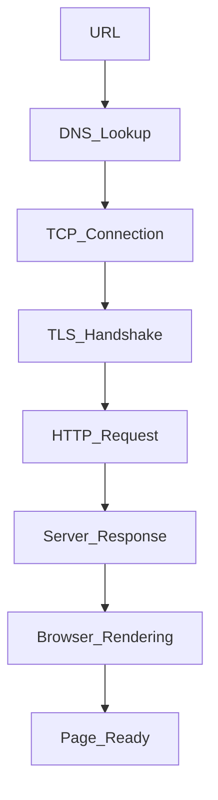

## 1. Tell me about your current and previous projects

---

## 2. What is your role in the current project

---

## 3. dsa question : give longest substring without repeating

---

## 4. What is javascript

[click](../03_JavaScript/notes/javascript_qna.md#L1)

---

## 5. What is ecmascript

## 6. synchronous vs asynchronous

---

## 7. If there is a function that's asynchronous and it's 100 lines long — do all those 100 lines run in parallel or at the same time?

- JavaScript is single-threaded, so even in an async function, the lines of code run sequentially until the first await.
- Only the asynchronous parts (after await) are paused and resumed later — they don’t run in parallel.
- So, the 100 lines don’t run simultaneously; they run in order, unless some lines use await, callbacks, or Promises.

---

## 8. ⚡ What Are Events in JavaScript?

## 9. 🎧 What is an Event Listener in JavaScript?

## 10. 📦 Data Types in JavaScript

## [click](MostImp.md#L31)

### 🧪 typeof Examples:

```js
typeof undefined; // "undefined"
typeof "hello"; // "string"
typeof 42; // "number"
typeof null; // "object" ❗ (JavaScript quirk)
typeof [1, 2, 3]; // "object"
typeof function () {}; // "function"
```

---

## 10.1 📦 Reference vs Value | Shallow vs Deep Copy in JavaScript

[click](MostImp.md#L59)

---

## 11. ⚖️ null vs undefined in JavaScript

[click](../03_JavaScript/notes/javascript_qna.md#L122)

---

## 12. 🔍 What is Scope in JavaScript?

## 13. Can We Create Scope Without Curly Braces?

## 14. lexical scope

- Lexical scope means that the scope of a variable is determined by its position.
- In JavaScript, child functions have access to variables defined in their parent functions because of lexical scope.

---

## 15. what is closures, where/why should we use it

## 16. what is hoisting

## 17. multi threading vs single threading

## 18. why javascript is so popular

## 19. can we use mongodb without javascript

## 20. what is callback in javascript

## 21. what is promises

## 22. why we should use promise i we already have callback

## 23. what is call back hell

## 24. What is polyfil

## 25. what is debouncing

## 26. what is closures, where should we use it

## 27. What is Recursion?

## 28. what is Promise.all and Promise.race

## 30. ⏳ What is the Temporal Dead Zone (TDZ)?

---

## 31. ⏱️ 1. setTimeout vs setInterval

## 32. how to stop setinterval

## 33. typeof

- `typeof` is an **operator** used to **check the data type** of a value.
- It returns a **string** describing the type.

---

## 34. 🧠 typeof Array in JavaScript, why

## 35. typeof string, any why ?

## 36. why type of array is object and string is string

## 37. 🌐 What happens when you type a URL and hit Enter?

- When I hit enter after typing a URL, the browser does a DNS lookup to find the IP, establishes a TCP connection, does a TLS handshake if it's HTTPS, sends an HTTP request, and then starts rendering the response — parsing HTML, applying CSS, running JS — until the full page loads.

### 🧭 Step-by-step Breakdown:

1. **DNS Lookup**

   - URL → IP address using DNS.

2. **TCP Connection**

   - `Browser` establishes a **TCP handshake** (via port 80/443).

<!-- 3. **HTTPS (TLS Handshake)**

   - If HTTPS, browser and server exchange certificates and keys. -->

4. **HTTP Request Sent**

   - `Browser` sends a **GET** request for the web page.

5. **Server Response**

   - Server sends back HTML, CSS, JS, images, etc.

6. **Browser Rendering**

   - HTML parsed → DOM created
   - CSS applied → Render Tree
   - JS executed → Dynamic content loaded

7. **Page Loaded & Displayed**

---



---

## 38. What is `this` keyword in JavaScript?

## 38.1 🌐 What is `this` in Node.js?

[`This`](../06_Node_Express/newnotes/this_in_node.md);

## 38.2 🔧 call, apply, bind in JavaScript

## 39. `console.log(this)` output in Browser vs Node.js, and why?

- **In Browser (global scope):**

```js
console.log(this); // window object
```

- `this` points to the global `window` object.

- **In Node.js (global scope):**

```js
console.log(this); // {}
```

- `this` points to an **empty object**, not the global object.

---

### 🧠 Why?

- Browsers use `window` as the global object, so `this` in the global scope equals `window`.
- Node.js wraps each file in a module wrapper, so `this` at the top-level refers to `module.exports` (an empty object `{}`), not the global object.

---

### Example:

```js
// Browser
console.log(this === window); // true

// Node.js
console.log(this === global); // false
console.log(this); // {}
```

---

## 40. 🧬 What is a Prototype in JavaScript?

## 41. output based

```js
console.log("Start");

setTimeout(async function () {
	console.log("Before await");
	await null;
	console.log("After await");
}, 0);

console.log("End");
```

```
start
end
Before await
After await
```

---

## 42. ⚙️ What is Node.js?

[09](../06_Node_Express/newnotes/nodejs_qna.md#L9)

---

## 44. 🚫 When to Avoid Using Node.js?

## [Click](../06_Node_Express/newnotes/nodejs_qna.md#L24)

## 45. what is event loop in node js

- js qna 13

---

## 46. ⚙️ What is the V8 Engine?

[Click](../06_Node_Express/newnotes/nodejs_qna.md#L68)

---

## 47. 🌐 What is a REST API?

- REST = **Representational State Transfer**
- A **REST API** is a way for systems to communicate over HTTP using **standard methods**.

---

## 48. difference between put vs patch

[Click](../06_Node_Express/newnotes/express_qna.md#L25)

---

## 49. 🚀 What is Express.js? Why use it? Pros & Cons

[click](../06_Node_Express/newnotes/express_qna.md#L5)

---

## 50. 🔁 What is `next` Function in Express?

- In Express.js, `next` is a **function** used in middleware to pass control to the **next middleware** or route handler.

---

### 📘 When is it used?

- Inside **middleware functions** to continue request–response cycle.
- If `next()` is **not called**, the request will **hang**.

---

### ⚠️ You can also use:

- `next('route')` → skips to the next route (used in routers).
- `next(err)` → passes an error to error-handling middleware.

---

## 51. 📦 What is `package.json`?

## 52. 🔐 What is `package-lock.json`?

## 53. 📦 package.json vs 🔐 package-lock.json

## 54. What happens if you delete `package.json`, `package-lock.json`, or both?

## 55. 🗑️ What happens if you delete `node_modules`?

## 56. 🌐 Can we use `http` module without `node_modules`?

[All](../06_Node_Express/newnotes/npm.md)

## 57. 🔧 What is Git?

- **Git** is a **distributed version control system**.
- Tracks code changes, allows collaboration, and manages project history.
- Created by **Linus Torvalds** (creator of Linux).

---

### 📌 Key Features:

- Track changes across files and branches.
- Revert to previous versions.
- Supports collaboration via platforms like GitHub, GitLab.

---

## 58. What is a Database?

## 59. Why use a Database instead of File System?

## 60. 🗃️ Types of Databases

1. **Relational Databases (SQL)**

   - Store data in tables with rows and columns.
   - Use structured query language (SQL).
   - Examples: MySQL, PostgreSQL, Oracle.

2. **Non-Relational Databases (NoSQL)**
   - Flexible schema, store data as documents, key-value, graphs, or wide-columns.
   - Examples: MongoDB (document), Redis (key-value), Cassandra (wide-column).

---

## 61. sql vs nosql

## 62. 🔗 What is a Foreign Key?

## 63. 🆔 What is a Unique Key?

## 64. ⚔️ ORM vs Raw Query

| Aspect         | ORM                            | Raw Query                    |
| -------------- | ------------------------------ | ---------------------------- |
| Syntax         | Uses programming language code | Uses SQL statements directly |
| Learning Curve | Easier for developers          | Requires SQL knowledge       |
| Flexibility    | Limited to ORM features        | Full control over queries    |
| Productivity   | Faster development             | More manual work             |
| Performance    | Slight overhead                | Usually faster               |

---

## 🗣️ What to say in the interview:

> "ORM lets you work with databases using code `objects`, making development easier. Raw queries give full control and can be faster but need SQL expertise."

---

## 65. 🔄 What are Transactions?

## 66. 📜 What are Stored Procedures?

## 67. ## ⚔️ Stored Procedure vs Function in SQL

> Stored procedures perform actions like insert/update and can return multiple values. Functions return a single value and can be used inside SQL queries.

---

## 68. 🧹 What is Normalization?

## 69. What is an Index in a Database?

## 70. ⚙️ How Indexing Works Internally

## 71. types is indexes

## 72. Can We Add Index to All Columns?

## 73. ⚛️ What is React.js?

## 73.2 Pros and Cons

## 73.2 📚 Library vs 🏗️ Framework

## 74. why use react.js if we had html css js

- kerinfotech - 2.2

---

## 75. what is dom

- kerinfotech - 3

---

## 76. what is virtual dom

- kerinfotech - 4

---

## 77. 🧩 What Are Components in React.js?

## 78. 🏛️ Can We Make React Components with Class?

## 79. state vs prop

- kerinfotech - 2.9

---

## 80. what is hooks

- kerinfotech - 2.5

---

## 81. ⚡ useState vs useMemo in React

- **useState**: Manages state in functional components. When state updates, it triggers a re-render.
- **useMemo**: Memoizes (caches) expensive calculations or values to optimize performance. It only recalculates when dependencies change and does **not** trigger re-renders.

---

> "useState manages component state and triggers re-renders when updated, while useMemo caches expensive calculations to avoid unnecessary recomputations."

---

## 82. let take scenario, you are only full stack developer in the team and frontend is not loading or giving 500 error what are the steps you will take to fix this

### Step-by-step approach:

1. **Check Browser Console & Network Tab**

   - Look for error messages, failed requests, or missing files.

2. **Inspect Server Logs**

   - Check backend logs for errors causing 500.

3. **Check API Endpoints**

   - Test if backend APIs are responding correctly.

4. **Review Environment Configurations**

   - Check if environment variables or configs are correct.

5. **Rollback Recent Changes**

   - If error started after recent updates, revert and test.

6. **Clear Cache & Cookies**

   - Sometimes stale cache causes loading issues.

7. **Use Debugging Tools**
   - Add logs or debug breakpoints if needed.

> First, I’d check browser errors and server logs for clues. Then verify the build and deployment are correct. I’d test APIs, review configs, and rollback recent changes if needed. Clearing cache and using debugging tools helps pinpoint the issue quickly.

---

## 83. 📊 suppose there is a dashboard and plenty of api is getting called in it how will decide which api is breaking or taking time longer then expected

### ✅ Step-by-step Approach:

1. **Open Browser DevTools → Network Tab**

   - View all API calls, their status codes, and timings.
   - Sort by **Time** or **Status** to find failing or slow ones.

2. **Check Console for JS Errors**

   - Sometimes API errors show up in logs.

3. **Use API Monitoring Tools**

   - Tools like **Postman, Thunder Client**, or **cURL** to manually test endpoints.
   - Identify if delay is on frontend or backend.

4. **Add Logging on Backend**
   - Log time taken for each API at controller/service level.
   - Helps catch backend bottlenecks.

> I’d use the browser network tab to spot failing or slow APIs, then check logs or APM tools to trace performance issues. Sorting by response time quickly shows the bottlenecks.

---

## 84. suppose you got the api which taking time longer then expected so would you speed up the api, what the step you will take in node and db

[click](../06_Node_Express/newnotes/optimize.md#L130)

> First, I’d analyze the API code for slow logic, then check the DB queries — using indexes, reducing payloads, and paginating results. I’d also add caching where possible and ensure async code is optimized for non-blocking execution.

---

## 85. suppose we have 2 gb memory and 4 bit cpu server(fixed non expandable) space and issue is from the server db has indexing , it query fast, and the issue is from server side because millions of request are coming to our server, so how will fix it

### 🖥️ Constraints:

- **2 GB RAM**
- **4-core CPU**
- **Millions of requests**
- **DB is optimized (indexed)**

---

### ✅ Steps to Fix (Smart Resource Handling):

### 1. **Enable Caching Aggressively**

- Use **Redis** or **in-memory** caching for frequent API responses.
- Serve static or semi-static data from cache.

---

### 2. **Rate Limiting & Throttling**

- Protect server from abuse:

```js
// Example with express-rate-limit
const rateLimit = require("express-rate-limit");
app.use(rateLimit({ windowMs: 1000, max: 100 }));
```

---

### 3. **Use Load Balancer or Reverse Proxy**

- Place **Nginx** or **HAProxy** in front to queue, compress, and offload static traffic.
- Enables better CPU handling.

---

### 4. **Offload Heavy Tasks to Queue**

- Use message queues (e.g., **RabbitMQ**, **Bull**) for background jobs like emails, PDF generation.

---

### 5. **Optimize Code**

- Avoid blocking operations (file sync, heavy loops).
- Use streaming for large data (e.g., file download/upload).

---

### 6. **Serve Static Files via CDN**

- Offload JS, CSS, images to **Cloudflare**, **S3 + CloudFront**, etc.

---

### 7. **Cluster Mode (if Node.js app)**

- Use all CPU cores with `cluster` or **PM2** to scale horizontally within one machine.

```js
const cluster = require("cluster");
const os = require("os");
if (cluster.isMaster) {
	for (let i = 0; i < os.cpus().length; i++) {
		cluster.fork();
	}
}
```

> Since DB is fast but the server is choking, I’d use Redis to cache common responses, add rate limiting to prevent abuse, and run Node in cluster mode to utilize all CPU cores. I'd also offload heavy tasks to a queue and serve static files via CDN to reduce load.
