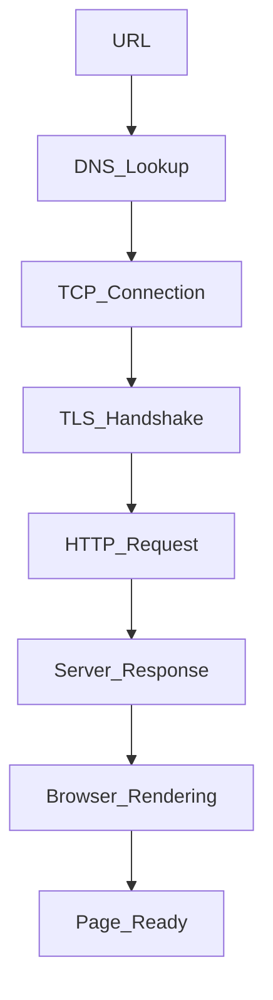

## Do you have any questions for me

1. What learning or growth opportunities do developers get here?
2. How does the company support developer growth?
3. Can you tell me about the kind of projects the team is currently working on?
4. What are the next steps in the interview process?
5. How do you see this company evolving in the next year?
6. What do you value most in your engineering team?

## 1. How to secure your node js application

[click](../06_Node_Express/newnotes/optimize.md#L81)

## 2. 📦 What is `package.json`?

[all](../06_Node_Express/newnotes/npm.md)

## 3. 🔐 What is `package-lock.json`?

## 4. 📦 `package.json` vs 🔐 `package-lock.json`

## 5. 🗑️ What if you delete them?

## 6. 🗑️ What if you delete `node_modules`?

## 7. 🌐 Can we use `http` without `node_modules`?

- ✅ Yes — `http` is a **core** Node.js module
- Core modules are built into Node.js (no need to install)

## 8 📦 Data Types in JavaScript

JavaScript has two main categories of data types:

---

### 🔹 1. **Primitive Data Types**

> Stored by value (not by reference)

- `String` → `"Hello"`
- `Symbol` → unique & immutable value (used as object keys)
- `Number` → `42`, `3.14`
- `Null` → intentional absence of value
- `Boolean` → `true`, `false`
- `BigInt` → large integers (e.g. `12345678901234567890n`)
- `Undefined` → declared but not assigned

---

### 🔸 2. **Non-Primitive (Reference) Data Types**

> Stored by reference (points to memory location)

- `Object` → `{ name: "John" }`
- `Array` → `[1, 2, 3]` (technically an object)
- `Function` → `function() {}` (also a type of object)

## 8.1 📦 Reference vs Value | Shallow vs Deep Copy in JavaScript

### 🔹 Primitive Types → Stored by **Value**

> Copying creates a new value. Changes don’t affect the original.

```js
const a = "Hello";
const b = a;

b = "World";
console.log(a); // "Hello"
```

### 🔸 Non-Primitives (Objects, Arrays) → Stored by Reference

> Copying just points to the same memory. Changes affect both.

```js
const obj1 = { name: "Alice" };
const obj2 = obj1;

obj2.name = "Bob";
console.log(obj1.name); // "Bob"
```

### 🔁 Shallow Copy

> Only top-level properties are copied. Nested objects are still shared.

```js
const obj1 = { name: "Alice", address: { city: "NY" } };
const obj2 = { ...obj1 }; // Shallow copy
const obj2 = Object.assign({}, obj1); // Shallow copy

obj2.name = "Bob"; // ✅ ok
obj2.address.city = "LA"; // ❌ affects obj1

console.log(obj1.address.name); // "Alice"
console.log(obj1.address.city); // "LA"


```

### 🧬 Deep Copy

> Fully independent copy (including nested objects)

```js
// ✅ Method 1: JSON trick (simple objects only)
const obj2 = JSON.parse(JSON.stringify(obj1));

// ✅ Method 2: structuredClone (modern, safe)
const obj2 = structuredClone(obj1);
```

---

## 9. What is lazy loading

- Loading parts of an app **only when needed**, instead of all at once.

  - Improves initial load time.
  - Saves bandwidth by loading resources on demand.
  - Commonly used for images, components, or modules.

  ```js
  import { lazy, Suspense } from "react";

  const MyComponent = lazy(() => import("./MyComponent"));

  function App() {
  	return (
  		<>
  			<Suspense fallback={<div>Loading...</div>}>
  				<MyComponent />
  			</Suspense>
  		</>
  	);
  }
  ```

---

## 10. What is code spliting

- Code splitting means **breaking your app’s bundle into smaller chunks**.
  - Loads only the necessary code for the current page or feature.
  - Reduces initial load time and improves performance.
  - Often used with tools like Webpack or React.lazy.
  - same like above with out suspence

## 11. What is `this` in JavaScript?

- `this` refers to the **context** in which a function is called
- Depends on **how** the function is invoked
- Arrow functions inherit `this` from their **lexical scope**

### 📌 Common `this` behaviors

| Context           | `this` refers to      |
| ----------------- | --------------------- |
| Global (browser)  | `window`              |
| Function (strict) | `undefined`           |
| Object method     | That object           |
| Arrow function    | Lexical (from parent) |
| Class constructor | The new instance      |

```js
const obj = {
	name: "JS",
	arrowFn: () => console.log(this), // ❌ not obj
	normalFn() {
		console.log(this);
	}, // ✅ obj
};
```

---

## 11.1 🌐 `this` in Node.js

- In Node.js, `this` behaves differently than in browsers

| Context               | `this` refers to       |
| --------------------- | ---------------------- |
| Global scope          | `{}` (not `global`)    |
| Function (non-strict) | `global`               |
| Arrow function        | Lexical (like browser) |
| Class method          | Class instance         |

```js
console.log(this); // {} in Node.js

function test() {
	console.log(this); // global
}
test();
```

---

## 11.2 🔧 `call`, `apply`, `bind`

- `call` – calls function with `this` and args individually
- `apply` – calls function with `this` and args as array
- `bind` – returns a new function with `this` bound

```js
function greet(msg, punc) {
	console.log(msg + ", " + this.name + punc);
}
const user = { name: "Alice" };

greet.call(user, "Hello", "!"); // Hello, Alice!
greet.apply(user, ["Hi", "!!"]); // Hi, Alice!!
const fn = greet.bind(user, "Hey", "?");
fn(); // Hey, Alice?
```

---

## 12. `console.log(this)` in Browser vs Node.js

### 🌐 In Browser (global scope)

```js
console.log(this); // window
```

- Global `this` points to `window`

### 🖥️ In Node.js (global scope)

```js
console.log(this); // {}
```

- Global `this` is `{}` due to module wrapper

### 🧠 Why?

- Browser: `this === window`
- Node: `this === module.exports` at top-level

```js
// Browser
console.log(this === window); // true

// Node.js
console.log(this === global); // false
```

## 13. Difference between `express.json()` and `express.urlencoded()`

Used in Express.js to parse incoming request bodies before your handlers.

### 📌 `express.json()`

- Parses incoming requests with `JSON` payloads
- Used for `application/json` content type

```js
app.use(express.json());
```

---

### 📌 `express.urlencoded({ extended: true })`

- Parses incoming requests with `URL-encoded` payloads (like from HTML forms)
- `extended: true` allows rich objects and arrays (uses `qs` library instead of `querystring`)

```js
app.use(express.urlencoded({ extended: true }));
```

---

### ✅ Key Points

- `express.json()` → for APIs sending JSON
- `express.urlencoded()` → for form data (`application/x-www-form-urlencoded`)
- You can use both if your app handles both types of data
- `extended: true` handles nested objects: `{ user: { name: "Tom" } }`

## 14. how to handle one to many relationship in mongodb

- A single document is related to multiple documents.

  - `Embedded`: When the "many" documents are few and tightly coupled.

  ```js
   { name: "User", posts: [ { title: "Post1" }, { title: "Post2" } ] }
  ```

  - `Referenced`: When the "many" documents are many, large, or independent.

  ```js
   // UserD
   { _id: 1, name: "User" }
   // Posts
   { title: "Post1", user_id: 1 }
  ```

---

## 15. 🌐 What happens when you type a URL and hit Enter?

- When I hit enter after typing a URL, the browser does a DNS lookup to find the IP, establishes a TCP connection, does a TLS handshake if it's HTTPS, sends an HTTP request, and then starts rendering the response — parsing HTML, applying CSS, running JS — until the full page loads.

### 🧭 Step-by-step Breakdown:

1. **DNS Lookup**

   - URL → IP address using DNS.

2. **TCP Connection**

   - Browser establishes a **TCP handshake** (via port 80/443).

3. **HTTP Request Sent**

   - Browser sends a **GET** request for the web page.

4. **Server Response**

   - Server sends back HTML, CSS, JS, images, etc.

5. **Browser Rendering**

   - HTML parsed → DOM created
   - CSS applied → Render Tree
   - JS executed → Dynamic content loaded

6. **Page Loaded & Displayed**

---



## 16. Find vs Aggregation Query (MongoDB)

[click](../07_MongoDB/newnotes/mongodb_qna.md#L213)

## 17. Single Connection vs Connection Pool

- Single Connection: One DB connection; simple but slow and bad for multiple users.
- Connection Pool: Multiple reusable connections; more efficient, handles concurrency, slightly more complex.

## 18. pool.query vs pool.execute

- Static / ad-hoc → fixed query, no parameters → `query` is okay.
- Dynamic / user input → changing values → always use `execute`.

## 18. express.json() vs express.urlencoded() vs bodyParsor.json()

- `express.json()` → parses JSON data (e.g. from APIs or frontend apps).
- `express.urlencoded({ extended: true })` → parses form data (`application/x-www-form-urlencoded`, like from HTML forms).

`extended: true` just means it can handle nested objects/arrays in form data.

## 19. mysql.createConnection vs mysql.createPool

- `mysql.createConnection()` → creates a **single DB connection**. Suitable for scripts or single queries.

  - Limitation: cannot handle many simultaneous requests, needs manual reconnects if dropped.

- `mysql.createPool()` → creates a **pool of reusable connections**. Suitable for **production apps**.
  - Handles multiple queries concurrently, auto-reconnects, configurable max connections.

✅ **Rule of thumb:** Use `createPool` in production, `createConnection` for simple scripts.

## 20. .env vs .env.local in Next.js

- `.env`: Default environment variables for all environments; shared across machines.
- `.env.local`: Local overrides for `.env`, ignored by git; used for secrets or machine-specific settings.

**Loading order:** `.env` → `.env.local` → environment-specific files like `.env.development` or `.env.production`.

## 20. Agile vs Waterflow method
